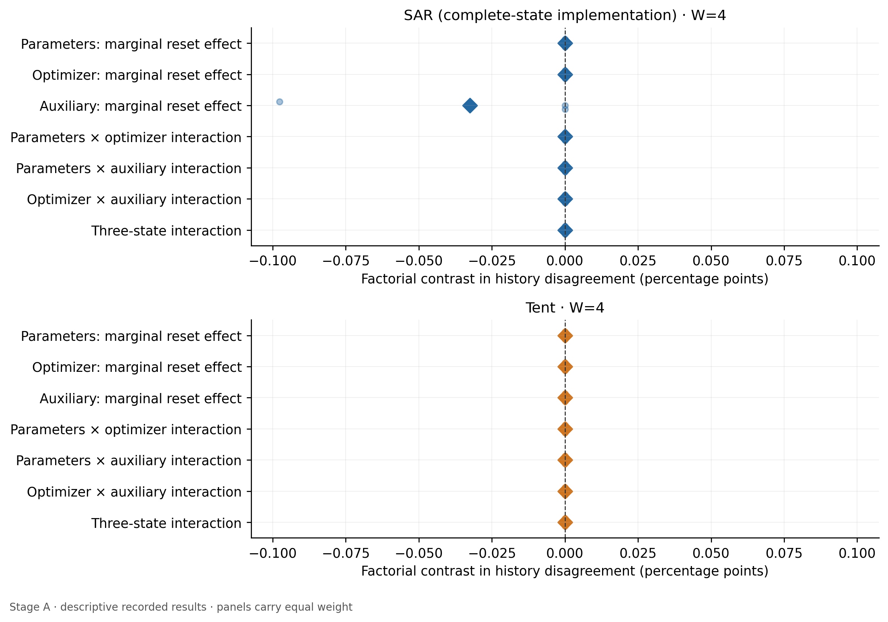
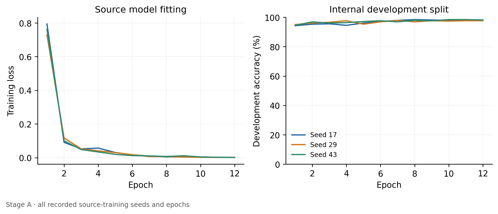
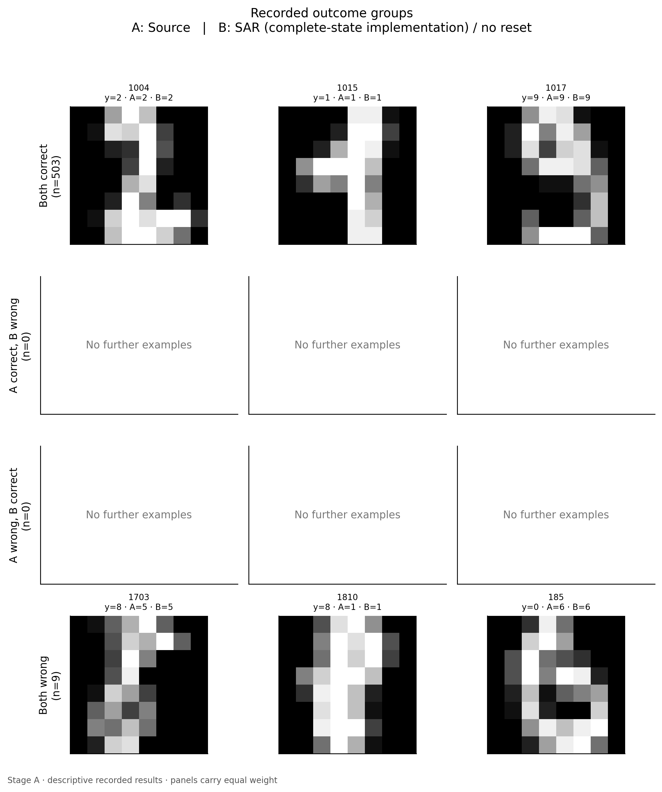
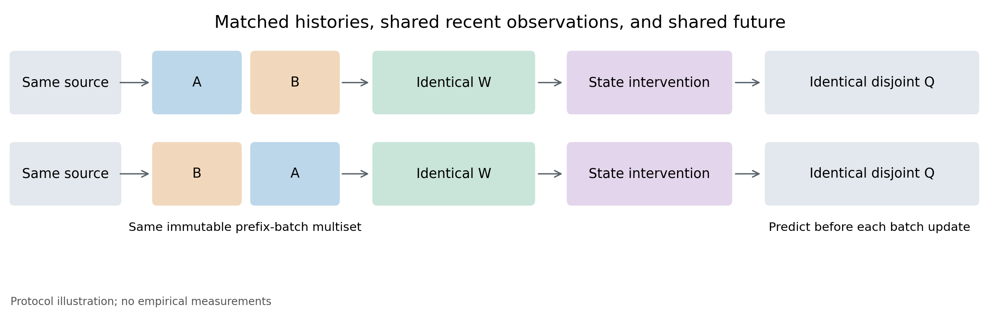

# Figures: stage_a_uci_v2

Stage A: descriptive correctness/sanity results only. Scenarios are averaged within each seed/panel, then repeated seeds within panel_id; each panel receives equal weight. SD and 95% t intervals describe variation across the supplied panel IDs, conditional on this dataset, model, and stream construction. Tiny local samples and three seeds cannot establish population generalization. Shared-image scenarios, suffix batches, and repeated seeds are not counted as independent panels. No p-values or statistical-superiority claims are generated. Metrics remain in raw units: accuracy/error fractions, NLL in nats/example; absolute gaps are finite-panel magnitudes, not unbiased absolute population effects.

## disagreement_washout

No external reset. Thin lines are descriptive seed repetitions on the same image panel; diamonds average panels equally. Disagreement indicates different decisions, not necessarily worse accuracy. No interpolation-based recovery-time claim or statistical-significance claim is made.

## state_reset_effects

Each contrast pairs the exact scenario/seed/panel/W with its no-reset reference before aggregation. Circles show seed repetitions on the shared panel and diamonds their mean. Negative values reduce history disagreement; they do not establish improved accuracy or identify a unique cause. Auxiliary-state resets include exactly the components declared by the runner; unknown intervention identifiers are printed verbatim.

## factorial_state_effects

Complete P/O/aux factorial only, excluding the extra all-state/buffer reset. Main effects average over other reset factors; pair interactions average over the third factor; the three-state interaction is a difference of pair interactions. Contrasts are formed within scenario/seed/panel before aggregation. Circles are descriptive source-seed repetitions on the same image panel. Diamonds show means. Auxiliary is EMA plus bookkeeping for SAR and bookkeeping for Tent; it is not labeled EMA-only. These response-scale contrasts are diagnostic and do not establish a unique causal state component.

## source_training

Every recorded source-training epoch/seed is shown. The development split supports source fitting and does not constitute untouched benchmark evaluation. Curves do not report held-out test accuracy.

## outcome_groups

A and B are identified in the figure; this may be source versus adaptation or AB versus BA, never mislabeled. All four correctness groups are displayed, including empty groups. The first eligible sorted run pair and first lexicographic IDs within each group determine examples without performance-based selection. The JSON manifest preserves full image IDs and counts. Images are recorded local normalized inputs.

## protocol_schematic

Experimental protocol schematic, not measured data. Prefixes differ only in immutable-batch block order; H/W/Q are disjoint by original identity. Common-tail length and intervention are recorded conditions. The intervention occurs after W and before pre-update Q prediction.

