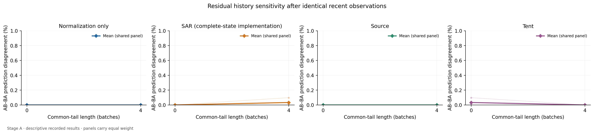
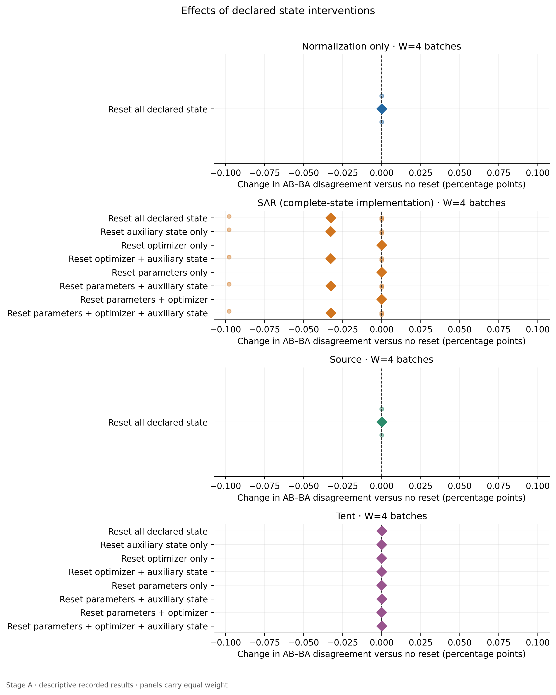

# What Does Adaptation Remember? Controlled History and State Interventions in Streaming Vision

**Research manuscript draft, 2026-09-08. Evidence status: completed local correctness study; benchmark pilot and confirmation pending explicit compute approval. This is not a completed submission.**

## Abstract

An adapting vision model carries experience through parameters, optimizer dynamics and auxiliary state. Average performance on different streams does not isolate what that experience changes on the same future observations. We define a paired protocol that permutes identical preformed historical batches, appends an identical recent tail, and evaluates an identical unseen suffix under explicit state interventions. Complete-state replay, matched per-batch randomness, source/norm invariance and pre-update predictions constrain the interpretation. We implement source, normalization-only, Tent and a separately named complete-state SAR variant. In an internal UCI training-only sanity study with three source seeds sharing one image panel, 528 directional trajectories yield 264 paired comparisons and 408 passing controls. Only two no-reset comparisons disagree, each on one of 512 future decisions; the maximum is 0.1953125 percentage point. This provides no evidence for the prespecified large-benchmark persistence hypothesis. A pinned SAR reference audit finds omitted nested optimizer momentum; a real six-trajectory comparison produces one differing suffix decision in one condition and favors the original implementation on that decision. The contribution currently consists of a tested protocol and a falsifiable experiment plan. Establishing nontrivial persistence, practical washout or a useful state-sensitive pattern requires independent-panel benchmark evidence and stronger baselines.

## 1. Introduction

Test-time adaptation updates a classifier from unlabeled deployment inputs. In a stream, those updates mean that two models with the same source checkpoint may respond differently to the same future image. That observation alone is unsurprising: sequential gradient updates need not commute. The scientifically useful question concerns the magnitude, persistence and consequences of this dependence after recent observations have been matched, and the state interventions that alter it.

Three common comparisons cannot by themselves answer that question. First, changing a stream often changes both historical and evaluated examples. Second, changing order may inadvertently change batches, augmentation draws or repeated original images. Third, a nominal reset may restore parameters while leaving optimizer momentum, teacher state or another adaptation variable intact. Differences then mix distinct mechanisms and implementation choices.

We investigate a narrower estimand: on a fixed unseen future, what remains different after two exact permutations of earlier batches have seen an identical recent tail? We then compare explicitly declared parameter, optimizer and auxiliary-state interventions. We do not propose a new adaptation loss or claim a universal causal decomposition. The study is useful only if it goes beyond predictable noncommutativity, known reset effects and implementation errors, or yields a precise and appropriately scoped negative result.

Our current deliverables are (i) a matched-stream construction and complete-state execution contract, (ii) an audited implementation and real local sanity study, and (iii) a frozen, costed benchmark pilot. The intended empirical contribution remains contingent. No ImageNet, second-backbone or second-dataset result is presented as measured here.

## 2. Related work and novelty boundary

[Tent](https://openreview.net/forum?id=uXl3bZLkr3c) established entropy-based test-time adaptation of normalization parameters. [SAR](https://arxiv.org/abs/2302.12400) addresses unstable wild adaptation through reliable entropy minimization, sharpness-aware optimization and recovery. These are substantive algorithms whose behavior must be compared under faithful semantics, not rebranded as our contribution.

Streaming dependence, memory and resets have extensive precedent. [RoTTA](https://arxiv.org/abs/2303.13899), [RDumb](https://nips.cc/virtual/2023/poster/71448), [PeTTA](https://arxiv.org/abs/2311.18193) and [UniTTA](https://arxiv.org/abs/2407.20080) prevent generic claims about temporal correlation or persistent adaptation. Recent [ASR](https://arxiv.org/abs/2603.03796), [OATTA](https://arxiv.org/abs/2601.21012) and [GoTTA](https://arxiv.org/abs/2605.19890) further constrain claims about selective resetting, temporal priors and memory policy. [TTABC v2](https://arxiv.org/abs/2606.14299v2) already emphasizes controlled adaptation comparisons. [AttenDence v1](https://arxiv.org/abs/2511.18925v1) specifically discusses optimizer memory after parameter reset; its exact title/version is retained rather than conflated with the retitled later work. [AETTA](https://openaccess.thecvf.com/content/CVPR2024/html/Lee_AETTA_Label-Free_Accuracy_Estimation_for_Test-Time_Adaptation_CVPR_2024_paper.html) uses disagreement for label-free accuracy estimation and recovery, although its predictor-disagreement estimand differs from paired historical order.

Our bounded search has not established this entire combination of matched preformed batches, identical recent tail, identity-disjoint shared suffix and explicit complete-state factorial comparison. That is a reason to investigate, not a certified first claim. The [literature ledger](../research/literature_review.md), [66-entry BibTeX file](../research/references.bib) and [adversarial novelty analysis](../research/novelty_analysis.md) retain exact evidence, uncertain metadata and competing explanations. Nine candidates across streaming adaptation, dense vision and VLM robustness were compared before selecting this direction; local GPU availability was not the selection criterion.

## 3. Controlled history protocol

### 3.1 Streams and prediction timing

Let H_A and H_B be two blocks built from different original images. Their preformed batches are held fixed. H_AB concatenates A then B; H_BA concatenates B then A. Thus the histories contain the same batch multiset, rather than merely equal numbers of domain examples. Append W, a shared recent tail, and Q, a shared future suffix. Original IDs are disjoint across H, W and Q; no original image repeats within a panel. Corruption views of the same original are not treated as independent identities.

For a requested k-batch tail, take the final k batches of one fixed maximum tail. This ensures the most recent content agrees across tail lengths. Interventions occur after H+W, immediately before Q. On each Q batch, record the first unperturbed forward output before updating from its unlabeled inputs. Current-batch normalization is permitted. Future batches and target labels do not enter that prediction or the adaptation API.

The execution harness sets matched randomness at each batch boundary, keyed to source seed, panel, H/W/Q role and ordered image keys. Direction, method, intervention and labels are excluded from the key. Matching historical batches receive the same random draws even when reordered; W and Q use separate roles. This design controls external randomness and does not measure history carried solely in a natural evolving RNG stream. Deterministic/pure loader behavior remains part of the interface contract. Version batch_crn_v1 includes absolute image paths in its random key; stochastic bitwise replay after moving the dataset therefore requires preserving those paths. A future path-independent key must be a versioned protocol change, not a silent rewrite of these results.

### 3.2 State and interventions

Write state S=(P,B,O,A,R): parameters; forward buffers/modes; optimizer including nested state; auxiliary variables; and random state. Fixed source anchors remain immutable. For Tent and SAR, adaptation is restricted to selected normalization affine parameters, with algorithm-specific forward configuration. SAR auxiliary state includes its entropy EMA and bookkeeping.

Use the eight P/O/A source-reset combinations, including no reset, plus an all-state reset that also restores B and common R. These states are diagnostic interventions; a hybrid of source parameters and historical momentum need not correspond to a natural deployment trajectory. Observed contrast is therefore intervention-specific sensitivity, not unique mediation by one state variable.

We require exact cold replay after all-state reset, complete snapshot/restore replay, source and normalization-only invariance to history, and first-Q-batch equality after parameter reset when forward state is equal. Under pre-update timing, optimizer differences can first affect predictions on the second Q batch. Checkpoints include the immutable source anchor and validated config/manifest/source hashes; failures retain batch IDs, inputs/logits when available, partial traces and state.

### 3.3 Estimands and decision rules

For panel j with n future images, D_j=(1/n) sum_i 1[argmax z_AB,i differs from argmax z_BA,i]. Consequences are distinct: E_AB−E_BA, its absolute finite-panel magnitude, NLL/Brier gaps and matched excess error versus the source. Disagreement need not imply harm, and zero argmax disagreement need not mean equal logits. Absolute finite-panel gaps are not asserted to be unbiased absolute population effects.

The frozen H1 condition is **SAR complete / ResNet-50 / no external reset / W16**, equally averaged across three fixed corruption-pair scenarios within each independent panel. A full-stage positive claim requires a 95% panel-level lower bound exceeding 1 percentage point plus a second architecture and dataset replication. A precise upper bound below 1 point can support practical washout in the evaluated setting; a wide interval is inconclusive. The H2 primary optimizer contrast is P+A versus P+O+A; the secondary auxiliary contrast is none versus A. Both are reported, with prespecified 0.5-point reduction and simultaneous uncertainty requirements. Full P/O/A interactions are secondary diagnostics.

For H2, define reduction as D(first arm) minus D(second arm). Average scenarios within each independent panel before inference. Use a two-sided 97.5% Student-t interval for each of the two contrasts, giving nominal 95% Bonferroni simultaneous coverage under the stated assumptions with critical value t[0.9875, n−1]. A practical-positive claim requires the corresponding simultaneous lower bound to exceed 0.5 percentage point. This assumes independent panels and an adequate approximation for panel means; individual-panel diagnostics and whole-panel bootstrap sensitivity with sufficient panels accompany confirmation. Inadequate precision or model fit is inconclusive.

These hypotheses were fixed before benchmark data execution, following local software development. They are not presented as preregistered before the already-observed local sanity data. No local result is used to claim H1 success.

## 4. Implementation and reference fidelity

The implementation uses PyTorch 2.9.1 and torchvision 0.24.1. Source is frozen evaluation; normalization-only updates no parameters and uses current-batch normalization. Tent follows entropy minimization; `sar_complete` follows reliable sharpness-aware updates while explicitly preserving/restoring nested optimizer state and guarding undefined empty/nonfinite updates. The name distinguishes corrected semantics from faithful reference SAR. Ordinary non-recovery behavior is checked against pinned official code; tests on actual untrained ResNet-50 and ViT-B/16 exercise BN/LN state paths without claiming pretrained performance.

The pinned [SAR reference](https://github.com/mr-eggplant/SAR/tree/20f6e24b17525f34503510afccedc0629b67b7c4) uses a SAM wrapper whose ordinary wrapper state omits its base SGD optimizer's momentum. A deterministic two-parameter quadratic audit shows wrapper-only restore retaining future momentum; the next parameter differs from complete restore by 0.08171052 at maximum. This is a serialization finding, not a CV accuracy effect or new optimizer. Its original code and licenses are preserved.

A separate real-image comparison runs untouched faithful SAR versus `sar_complete` on six fixed AB+W4+Q trajectories using the same three trained sources and two scenarios. Across 216 paired batches, all 78 ordinary pre-recovery equality controls pass. Both variants record 103 intrinsic recoveries over these trajectories. One seed 17 blur suffix differs on one of 512 decisions: faithful SAR has 0.1953125 percentage point lower error. The other five suffixes have identical decisions. Maximum suffix logit difference is0.04099655 and maximum absolute NLL difference 0.00332255 nats. Thus the correction has a measured, small, heterogeneous local effect and cannot be assumed to improve performance. [Raw comparison and report](../research/sar_recovery_comparison.md) preserve exact settings and failures/guards. The cloud benchmark must retain this comparison before broad SAR-specific claims.

## 5. Experimental setup and statistical scope

Stage A uses only the original [UCI optical digits training file](https://archive.ics.uci.edu/dataset/80/optical+recognition+of+handwritten+digits). Its official test partition is not used. A fixed ID split assigns 2,048 images to source training,384 to internal development,512 to history,128 to the maximum tail,512 to Q and 239 unused. We fit a small two-convolution BN DigitCNN independently with seeds 17, 29, 43 for 12 epochs, Adam lr 0.003, batch 64, retaining the fixed final epoch. Inputs are scaled by 16; deterministic local noise, brightness and blur transformations are implementation probes, not official benchmark corruptions.

The two scenarios are noise+brightness history to blur Q, and blur+noise history to clean Q. Batch 32, W0/4, adaptive SGD lr 0.001 and momentum 0.9 are fixed in the local YAML. The nine reset arms apply to Tent/SAR; source/norm use no-reset and all-reset controls. No proposed-model training advantage exists because this is a protocol investigation rather than a new trained method.

All three source seeds and both scenarios reuse one image panel. We first average paired directions and scenarios within source seed where appropriate, then report seed means and sample SD. Those SDs describe source optimization variability; they are not independent-panel confidence intervals. We do not treat Q images, branches, scenarios or repeated runs as independent trials. There are no significance claims or simulated confidence intervals for the local result.

Stage A v2 took 144.67 seconds on an Intel i5-1145G7 CPU with two PyTorch threads. The earlier v1 and hardened v2 remain preserved; the separately recorded parity audit distinguishes changed RNG/serialization infrastructure from unchanged image predictions. Configs, raw outputs and producer/analysis hashes document what actually ran.

## 6. Results

### 6.1 Source fitting and history sensitivity

| Seed | Final-epoch training loss | Internal development accuracy (%) |
| --- | --- | --- |
| 17 | 0.001624 | 98.1771 |
| 29 | 0.001138 | 97.6562 |
| 43 | 0.001033 | 98.1771 |

Table 1. Clean internal development accuracy at the fixed final source-training epoch. These figures are not corrupted-Q performance or external test results.

| Method | W | Seed17 D (pp) | Seed29 D (pp) | Seed43 D (pp) | Mean (pp) | Seed SD (pp) |
| --- | --- | --- | --- | --- | --- | --- |
| Source | 0 | 0.000000 | 0.000000 | 0.000000 | 0.000000 | 0.000000 |
| Source | 4 | 0.000000 | 0.000000 | 0.000000 | 0.000000 | 0.000000 |
| Normalization only | 0 | 0.000000 | 0.000000 | 0.000000 | 0.000000 | 0.000000 |
| Normalization only | 4 | 0.000000 | 0.000000 | 0.000000 | 0.000000 | 0.000000 |
| Tent | 0 | 0.097656 | 0.000000 | 0.000000 | 0.032552 | 0.056382 |
| Tent | 4 | 0.000000 | 0.000000 | 0.000000 | 0.000000 | 0.000000 |
| SAR complete | 0 | 0.000000 | 0.000000 | 0.000000 | 0.000000 | 0.000000 |
| SAR complete | 4 | 0.097656 | 0.000000 | 0.000000 | 0.032552 | 0.056382 |

Table 2. No-reset disagreement, averaging the two scenarios within each seed. Units are percentage points. Each nonzero scenario-level comparison contains exactly one of 512 differing Q decisions; averaging scenarios and seeds gives 0.03255208 point in the affected cells. W16 was not run locally. The other no-reset scenario comparisons are zero.

Figure 1. Local W0/4 measurements; axes and captions retain the one-panel limitation. The near-zero result must not be interpreted as a powered practical-equivalence conclusion.

### 6.2 Accuracy, loss and reference-relative harm

| Method | Seed17 accuracy (%) | Seed29 accuracy (%) | Seed43 accuracy (%) | Mean ± seed SD (%) | Mean NLL |
| --- | --- | --- | --- | --- | --- |
| Source | 86.8164 | 84.3750 | 73.0469 | 81.4128 ± 7.3472 | 0.551879 |
| Normalization only | 85.8398 | 84.4727 | 88.0859 | 86.1328 ± 1.8244 | 0.513794 |
| Tent | 86.1328 | 84.4727 | 88.0859 | 86.2305 ± 1.8086 | 0.514407 |
| SAR complete | 85.8887 | 84.4727 | 88.0859 | 86.1491 ± 1.8207 | 0.514120 |

Table 3. W4 no-reset Q accuracy, mean±sample SD over three source seeds after equal direction/scenario averaging. NLL is in nats per example. Source/norm comparisons use exactly matching Q IDs and conditions. These descriptive means cannot establish method superiority.

Source sensitivity to blur is heterogeneous. Seed17 source accuracy is75.3906% versus 73.4375% for norm,73.5352% for SAR and 74.0234% for Tent: all three adaptations hurt accuracy and NLL. Seed29 gains 0.1953 point in accuracy while its NLL worsens. Seed43 improves from 47.6563% source accuracy to 77.7344% for each adapted method, driving most of the positive pooled source-relative contrast. Relative to normalization-only, mean adaptive gains are much smaller. On clean Q, all four methods share each seed's recorded accuracy. Per-scenario and per-seed tables are retained rather than selectively displaying the favorable aggregate.

### 6.3 State ablations and recovery behavior

All 408 protocol controls pass. Every all-state reset matches the same cold adapter on Q and has zero AB/BA disagreement. That is a necessary implementation result, not evidence that reset improves robustness. For Tent seed 17 at W4, all-state reset reduces scenario/direction-averaged accuracy by 0.1953125 point, although no-reset decision disagreement was already zero.

In SAR seed 17, blur Q, W4, the first Q batch is identical across orders but one later decision differs. The no-reset suffixes log 4 versus 3 recoveries. Parameter, optimizer and combined P/O resets preserve that observed decision pattern; auxiliary-containing interventions yield equal decisions/losses and 2 recoveries per direction. Auxiliary state includes EMA and bookkeeping, so this is not an isolated EMA-only causal result. Across all 216 SAR suffix branches, 2108 recoveries and 0 skipped updates are logged. Repeated branches are not independent recovery events for inference. Frequent recovery limits how much sustained optimizer history this local setting can reveal.

Figure 2. Intervention-minus-no-reset effects on history disagreement. The full factorial, accuracy/NLL consequences and individual seed values accompany the figure in machine-generated tables. Eliminating disagreement and improving predictive performance are separate outcomes.

### 6.4 Error analysis

The analysis records paired source/adaptation correctness groups, raw logits, labels, base IDs and source-relative error/loss changes. Example selection is deterministic and all four correctness groups are shown, including empty groups. The chosen clean-Q display has 503 both-correct and 9 both-wrong cases, with no source-only or adaptation-only successes. It illustrates an actual recorded comparison and cannot summarize the blur-Q harms. The per-scenario table and paragraph above therefore carry the error analysis; images are examples, not prevalence evidence. No explanation for seed 43's unusual source blur sensitivity is established by this study.

## 7. Planned benchmark validation

The prepared pilot uses released [ImageNet-C](https://github.com/hendrycks/robustness) JPEGs and pretrained ResNet-50 IMAGENET1K_V1. A deterministic original-ID hash allocates a 20% pilot pool; reserved image contents and evaluation outcomes are not used; filename/class-folder inventories may be inspected. Three disjoint panels of 2,560 original images each supply 1,024 H, 512 W and 1,024 Q. Each panel is reused across three fixed scenarios combining gaussian_noise, brightness and defocus_blur, severity 5. W0/4/16 and the locked method/reset matrix produce 594 paired suffix runs. The pilot is intentionally underpowered and estimates engineering behavior and panel variance, not definitive significance.

The larger initial design uses 24 disjoint panels of 1,536 images from the reserved 80% pool. The panel sizes jointly respect the 50,000 base-ID budget. This is a capacity-limited initial design, not a power guarantee. The pilot has longer H and Q than confirmation (1,024 rather than 512 each), so its effect/variance scale cannot be transferred directly to a confirmation sample-size formula. If approved, freeze N=24 and interpret its prespecified intervals without optional stopping. A different sample size requires a separately budgeted confirmation-sized calibration design and a new freeze before reserved outcomes are used. Inadequate precision is inconclusive; repeated source seeds cannot replace independent image panels.

A completed paper also requires a recent selective-reset baseline such as ASR, a persistent baseline with a complete state inventory, faithful/corrected SAR comparison, frozen versus adapting Q, momentum 0/.9, component swaps, a second backbone and second audited dataset. EATA is conditional on legitimate source Fisher data. Layer-normalized Tent is explicitly an extension of the original BN implementation. These are missing requirements, not claimed implementations or result tables. No mCE is reported from three corruptions at one severity.

## 8. Discussion, limitations and research integrity

The strongest present evidence concerns execution correctness, the explicit reset-state distinction and the need to separate disagreement from useful robustness. The local history effects are almost absent, and adaptation can harm performance even when its aggregate mean looks favorable. This argues against presenting a toy positive result as the main contribution.

Matched synthetic blocks do not model natural chronology. W16 denotes 512 recent images at a particular batch size, not an intrinsic memory time constant. Adaptation during Q can amplify or erase junction differences; mandatory frozen-Q controls are still required. Hybrid reset states do not identify unique causal mediation. Snapshot completeness is guaranteed only for declared current adapters, not future teachers/caches/schedulers. Stochastic loader behavior beyond the tested contract remains a portability concern. Determinism and preprocessing must be revalidated on the actual GPU environment.

External validity, sufficient independent-panel precision and stronger baseline evidence are absent. Source pretraining overlap cannot be fully audited. The literature search is broad but bounded, and prior work may subsume the eventual contribution. These are scientific blockers to publication, not footnotes that a successful unit test removes. The independent reviewer currently rates this a Strong Reject if submitted as a completed empirical paper; free engineering revisions do not supply missing benchmark evidence.

All reported measurements come from preserved files. No paid resource has been used; no target labels tune adaptation; negative branches and harmful results remain included. The manuscript is generated from actual Stage A tables with input hashes. Complete execution and all planned experiments remain subject to the user's explicit paid-compute approval.

## 9. Conclusion

We provide a concrete, audited protocol for comparing what different adaptation histories change on the same future. The real local study establishes software behavior and exposes a reference-state distinction, while providing no substantial persistence evidence. The research question remains open until a controlled benchmark pilot and sufficiently precise, broader validation determine whether persistent history, practical washout or implementation sensitivity is the defensible finding.

## Reproducibility and references

Start with [README](../README.md). Raw experiment: `results/stage_a_uci_v2`; machine-readable claim values and input hashes: [claims.json](claims.json). Figures and detailed tables include analysis provenance. All 66 bibliographic records, exact version notes and primary links appear in [references.bib](../research/references.bib); the selected works are linked inline. The source manuscript is Markdown; no compiled PDF is represented as available. The supplementary [research log](../research/research_log.md), [reviewer audit](../research/reviewer_audit.md) and [response](../research/reviewer_response.md) preserve failures, decisions and remaining work.
